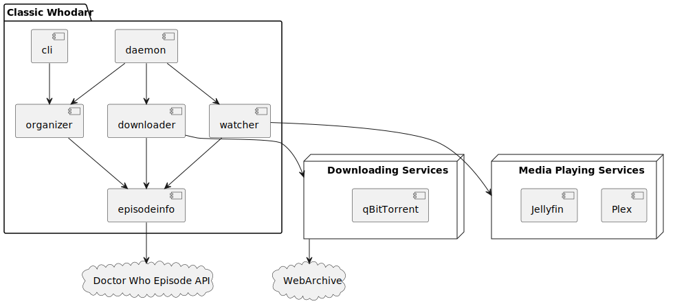

# Classic Whodarr

(Or more accurately, whonarr*)

Automatically download Classic Doctor Who (only from official sources) and reorganize them into a format Plex/Jellyfin can understand.

## Modules

The following description describes the program once it reaches v1.0

The project contains the following modules:

 - Daemon (Tray application)

This is the primary way to interact with the program. It shows which episodes are downloaded

 - Downloader

This module keeps track of which episodes to download based on look-ahead settings specified in the configuration. Furthermore, it interacts with qbittorrent to queue downloades of the episodes (Torrents are used to not strain WebArchive services).

The downloader module also downloades appropriate subtitles and names them to be picked up.

 - Organizer

This module refactors the downloaded files into a new folder structure and renames the files for them to be efficiently picked up by Plex/Jellyfin.

 - Watcher

Watcher-module interacts with Plex/Jellyfin to tell the watching progress. It notifies the Downloader-module once an episode has been seen, to check if new ones should get downloaded.
